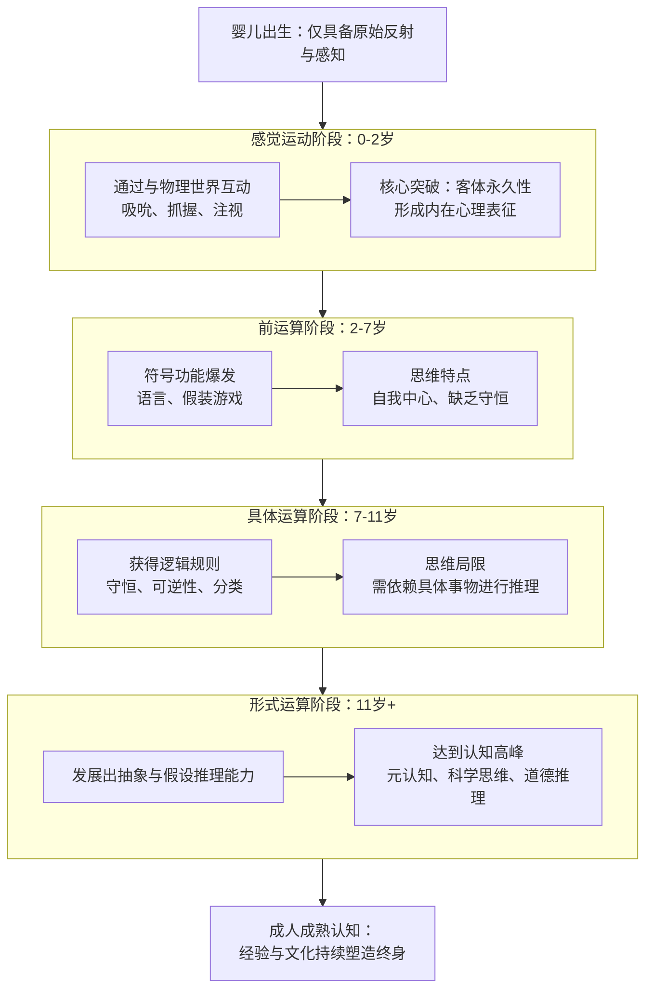
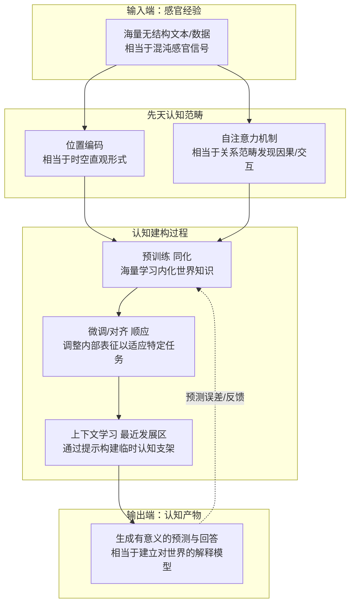

---
title: "关于人类与大模型的思考"
date: 2026-07-19T20:28:11+08:00
draft: false
categories:
  - "外物报"
---

# 关于人类与大模型的思考
> 你所使用的`Deepseek`、`Qwen`、`ChatGPT`、`Gemini`等等各种大模型，它们都可以对你的提示词输出语意连贯、逻辑较强的回答。上下文、提示词的语气、副词、表达方式都会影响模型的输出结果，这是理所当然的。另外，模型也可以通过对输入内容的理解模拟出情绪变化。这一切当然不言而喻。
>
> 但是，**如果把模型的表现和人类做对比呢**？一个智力正常、认知正常、人生生活经历正常的人，犹如一个训练到位的大模型，当你向他“输入”各种“提示词”，他也会对此“输出”回答。同样，你的“提示词”的变化，也会影响这个“人类模型”的输出结果...
>
> 总之，**大模型看似是冰冷的统计学、机器学习、计算机科学等构建出的产物，作为人工智能的它们似乎的确和人类的思考方式如出一辙**。

## 接近人类认知方式的大模型
为什么这么说？先从我们都好理解的人类讲起。

### 人类

**人的“认知模型”的建立是一个长久而多元的过程**。从我们出生那一刻起，我们带着DNA赋予我们的先天能力来到这个世界，这先天能力便包括了我们如何感知这个世界、我们思考的最底层的模式...

于是从人生的第一秒开始，我们就开始不断地接受外界的信息了：声音、触感、温度、光（视觉）...**大脑接受到这些信息，便通过理性去加工和认识这些信息。就这样，我们慢慢就形成了对世界的基本认知。**

我们会学习语言，理解符号中蕴藏的信息。通过亲身经历、阅读、以及教导，我们接受了更多的信息，得到了更多“训练”，我们明白了我们生活在地球上，明白了因为万有引力所以物品总会下落、明白了四季更替和这炎热的夏天。**我们的学习，正是把接受到的“直觉”加工为经验和知识的过程。通过经验和知识，我们能够对于不同的事件做出合适的处理。**

人类对事物的理解是符合一些逻辑规律的，也就是我们对于世界的理解方式。康德的哲学中有一种叫做“范畴”的东西，它的解释是：“**我们的心灵本身有一套先天的认知结构，它像一个有形状的容器，所有后天经验倒入其中，就必然被塑造成符合容器形状的样子。 这套结构就是范畴**。"

人类的认知不是一成不变的，我们一生都在不断学习。从前你以为大学生就是每天学一些~~牛逼哄哄~~的知识，做一些~~牛逼哄哄~~的研究，毕业后做~~牛逼哄哄~~的工作。后来根据你得到的新的信息，你调整了这个想法，大多数大学生也只不过只是期末周要赶忙复习，搞不好还要挂科的孩子罢了。

#### 总结
人类的认知模式，是一种主动的意义建构机制。它并非被动记录世界，而是以大脑内置的时空框架与因果、实体等先天范畴为基础，将杂乱的感官信号整合为有序的经验。在此基础上，个体通过与物理世界互动和在社会文化中学习，不断经历同化与顺应的认知成长，最终形成一个集预测、解释与行动导向于一体的动态心智模型。

*也就是：你得到了什么，左右了你成为什么，而你是什么，也同时左右了你会得到什么。*

事实上，现代的大模型已经很接近于我们的认知方式。以我们都常见的大语言模型（LLM）为例。

### 大语言模型

模型是什么，**模型（Model），是对真实世界里复杂事物、规律、系统做简化抽象后，用来描述、预测、推演的标准化结构**。

**大语言模型不仅抽象了自然语言使模型能够“理解”自然语言，还通过“理解”产生了输出。犹如人类学习知识并运用知识做出反应。**

**所有的模型都需要训练，训练犹如人类的学习行为。**模型的内部实现是一个庞大的数学系统，通过输入的内容和“正确”的输出让模型通过反向传播和梯度下降不断调参优化。这些参数决定了模型对于一段输入输出什么内容。**好比人类接受各种信息认知学习的过程**。

我们可以设想这样一个有趣的场景：在训练时输入“大学生是什么样的？”，模型输出“~~牛逼哄哄~~”。这显然是错误的，调整参数后，再次尝试，模型输出：“天天只会摸鱼的~~区~~”。你看，这个认知过程，是不是和人类很像？

训练好的大模型还需要一些处理，才能有更好的对话效果。大概就是告诉它，对于胡说八道和好好回答我的问题，你应该选择后者。

当数据量足以支撑模型形成“认知能力”后，大模型便能够逻辑推理、数学计算、翻译、代码编写、阅读理解、归纳总结、创意写作。好像拥有了人类般的智能。

此时你说一句，你好。如果是我，我经历了很多次这样的问候，我的思考给出的结果是：回复你“你好”。如果是模型，模型从训练时无数次你好的“经历”中明白，此时它应该回答：

不过模型当然并没有真的在理解什么，如果是这样，它就不叫模型了。对于理解这一行为，模型的表现是内部正确的数学参数。而这，不就恰恰是它的理解吗。我们人类对于某件事物的理解，又有何不可用参数来形容呢？

#### 总结
大语言模型的认知模式，是以自注意力机制为核心的概率建构系统。它将符号转化为向量，在海量训练中捕捉并存储世间关联的统计规律，生成时再依据上下文逐词预测，动态收敛为一段连贯、有意义并能回应语境的文本。

--- 

读到这里，我想已经不必多说。我们的思考方式，大概真的和大模型在某种程度上并无不同。注意：是某种程度。

## 人类 != 模型
**所以，我其实是个人机对吗？**

**不对。**

尽管人类和大模型都通过海量信息建立认知，通过认知做出行为，通过“学习”不断优化认知，似乎是同一个模子里刻出来的，但这是抽象意义上的，毕竟这玩意做出来就是为了模仿我们的。

从具体意义上讲，人和模型还差很多。如上所说，你对于大学生的理解是摸鱼~~区~~，但大模型并不是这样的，**你的大脑支持你理解什么叫摸鱼，但大模型不行。模型没有所谓的理解，它对于大学生“认知”就是一堆参数**。在这一点是，人和模型是截然不同的。

另外，**你是有个有记忆、有经历、有感情的人，而大模型并没有，它在用数学去模拟这些，这些对于它来讲依旧是一堆数字**。而你对于这些有着具体的印象。你有欲望，在决定今晚吃多少饭的时候，你的饥饿感通过影响你的感受来迫使你吃更多的饭，这个过程从数学上讲就是在计算吃多少的时候饥饿感数值的权值参与计算，从而使计算结果变大，而大模型仅保留了数学意义的。（模型并没有真的计算这样一个数值，而是另一种方式）。

人类和模型还有不少地方是有差别的，这里不再一一列举。

但是这样的差别不影响我们认为模型和人类很像，从抽象意义上讲，的确是这样的。
## 从模型出发，思考人类
所以呢。

**所以，很多时候，你可以跳脱出一些具体的意义来思考。**

### 我们的决定，其实都是模型结果？
当你做出某个决定的时候，你并不是完全自由地在做这个决定，只是在当前的“上下文”下，在你这个“模型”下，你“计算”出的结果。

回到吃饭的事上，所以，你今晚吃多少饭？
- 情形1：你中午没吃饭，你太饿了，并且你没有什么其他别的不多吃的理由，所以你给出的答案一定是：“大吃”。
- 情形2：你中午没吃饭，你太饿了，但我正拿枪指着你，我告诉你你今晚一旦吃饭我就枪毙你，你害怕我射杀你胜过不吃饭，所以你给出的答案一定是：“不吃”。

其实很好理解，简单来讲就是：**某个决定的结果受到各种因素影响。在因素确定时，结果一定**。

**所以，你的想法，你做的事，几乎都是在那之前的某个时间就可以计算得出的必然事件，没有什么事凭空而来的。**

很多时候我们的确无力再改变变量，结果已然确定。很多时候我们的确可以力挽狂澜，改变变量，扭转命运！

我不知道这是否意味着宿命论，我也不敢宣称我们应该怎么做。**说这么多，只是提供一个新的思考方式，一个新的角度，一段新的无关紧要的话。**

该怎么处理这段文章的输入，就交给你来决定了。愿我的一点文字能为你的模型带来更优的参数。
